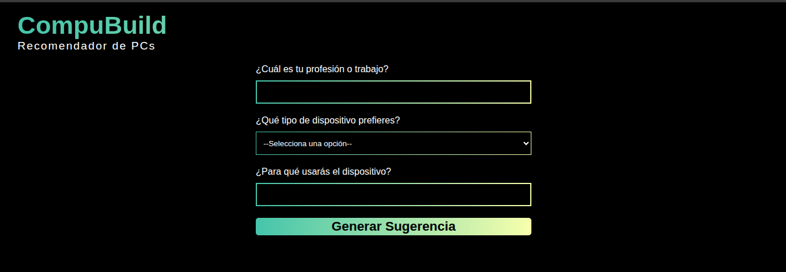
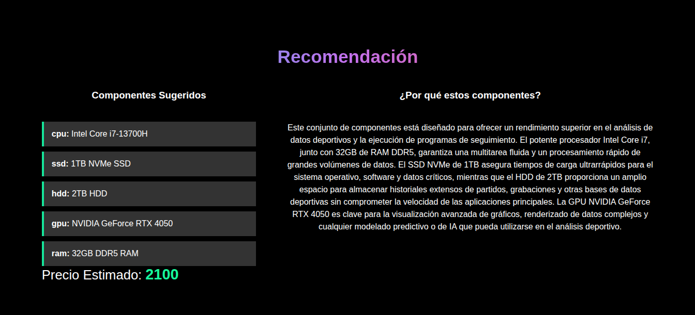
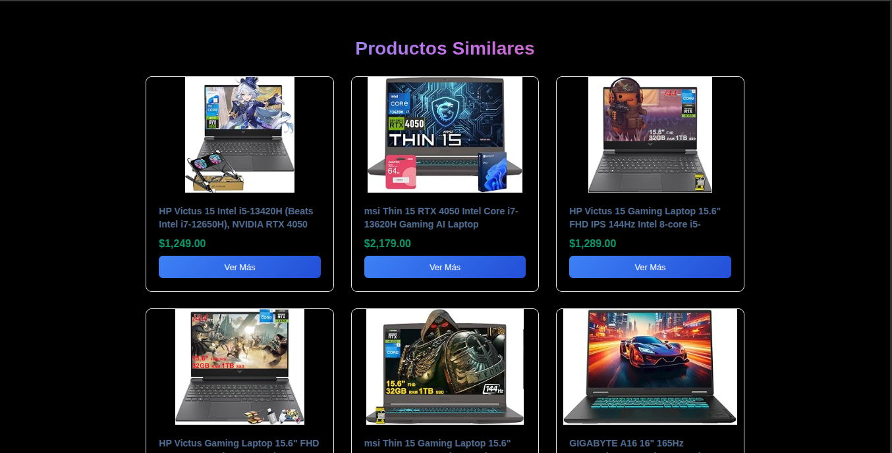

# CompuBuild

AI-powered PC recommendation web application that helps users find computer configurations based on their profession, preferred device type, and intended use.

The application combines **Google Gemini** for intelligent hardware recommendations with **SerpApi** to search for similar products available on Amazon.

## 🚀 Live Demo

**[CompuBuild](https://compubuild.vercel.app/)**

## 📌 Overview

Choosing the right computer can be difficult when hardware requirements vary depending on a person's profession and workflow.

CompuBuild simplifies this process through an interactive form where users provide:

* Their profession
* Preferred computer type: **Laptop** or **Desktop**
* A description of how they intend to use the computer

The application sends this information to the backend, where **Google Gemini** analyzes the requirements and generates a personalized recommendation.


After generating the recommendation, **SerpApi** is used to search Amazon for similar products, allowing users to explore real-world products related to the recommended hardware.

## ✨ Features

* 🤖 AI-powered PC components recommendations
* 💻 Laptop and desktop recommendations
* 👨‍💻 Recommendations based on profession
* 📝 Custom usage descriptions
* 🔎 Amazon product search through SerpApi
* ⚡ React frontend
* 🚀 FastAPI backend
* ☁️ Separate frontend and backend deployments
* 🔐 No authentication required
* 🗄️ No database required

## 🏗️ Architecture

CompuBuild follows a simple client-server architecture:

```text
┌─────────────────────────┐
│       React Frontend    │
│                         │
│  Recommendation Form    │
└────────────┬────────────┘
             │
             │ HTTP Request
             ▼
┌─────────────────────────┐
│      FastAPI Backend    │
│                         │
│  Request Processing     │
│  Gemini Integration     │
│  SerpApi Integration    │
└───────┬─────────┬───────┘
        │         │
        ▼         ▼
┌────────────┐  ┌────────────┐
│ Gemini API │  │  SerpApi   │
│            │  │            │
│ AI PC      │  │ Amazon     │
│ Recommend. │  │ Products   │
└────────────┘  └────────────┘
```

## 🛠️ Tech Stack

### Frontend

* React
* JavaScript
* Vite
* CSS

### Backend

* Python
* FastAPI

### APIs & Services

* Google Gemini API — generates personalized PC recommendations
* SerpApi — searches Amazon for similar products
* Vercel — frontend deployment
* Render — backend deployment

### Data Storage

CompuBuild does not use a database. User requests are processed dynamically through the backend and external APIs.

## 🔄 How It Works

### 1. User Input

The user completes the recommendation form by providing:

```text
Profession
     +
Device Type
     +
Intended Use
```

For example:

```text
Profession: Software Developer

Device: Laptop

Use:
"I need a computer for backend development,
Docker containers, programming and occasional
machine learning experiments."
```

### 2. Backend Processing

The React frontend sends the user's information to the FastAPI backend through an HTTP request.

The backend processes the request and prepares the information for the AI recommendation.

### 3. AI Recommendation

The backend communicates with the **Google Gemini API**.

Gemini analyzes the user's profession and requirements to determine an appropriate hardware configuration and provide a recommendation based on the described workload.

### 4. Product Search

Once the recommendation is generated, the application uses **SerpApi** to search Amazon for products related to the recommended hardware.

This provides users with actual products that they can explore.

### 5. Results

The frontend presents the recommendation and related products to the user in a single interface.

## 📂 Project Structure

```text
compubuild-webapp/
│
├── Backend/
│   ├── ...
│   └── ...
│
├── Frontend/
│   └── recommender_pc/
│       ├── src/
│       ├── public/
│       ├── package.json
│       └── ...
│
└── .gitignore
```

The project is divided into two main applications:

* `Backend/` — FastAPI application responsible for API requests, Gemini integration, and product search.
* `Frontend/recommender_pc/` — React application responsible for the user interface and interaction.

## ⚙️ Environment Variables

The backend requires API credentials for the external services.

Create a `.env` file in the backend:

```env
GEMINI_API_KEY=your_gemini_api_key
SERPAPI_API_KEY=your_serpapi_api_key
```

Do not commit API keys or other secrets to the repository.

## 💻 Local Development

### Prerequisites

Make sure you have installed:

* Python 3.10+
* Node.js
* npm
* Git

### Clone the Repository

```bash
git clone https://github.com/callmeerik/compubuild-webapp.git

cd compubuild-webapp
```

### Backend

Navigate to the backend:

```bash
cd Backend
```

Create and activate a virtual environment:

```bash
python -m venv .venv
source .venv/bin/activate
```

Install the dependencies:

```bash
pip install -r requirements.txt
```

Configure your environment variables:

```env
GEMINI_API_KEY=your_gemini_api_key
SEARCH_API_KEY=your_serpapi_api_key
```

Start the FastAPI server:

```bash
fastapi dev main.ppy
```

The backend will be available at:

```text
http://localhost:8000
```

FastAPI also provides interactive API documentation at:

```text
http://localhost:8000/docs
```

### Frontend

Open another terminal and navigate to the React application:

```bash
cd Frontend/recommender_pc
```

Install dependencies:

```bash
npm install
```

Start the development server:

```bash
npm run dev
```

The frontend will be available at the local URL provided by Vite.

## ☁️ Deployment

The application is deployed as two separate services.

| Component      | Technology        | Platform |
| -------------- | ----------------- | -------- |
| Frontend       | React + Vite      | Vercel   |
| Backend        | FastAPI + Python  | Render   |
| AI             | Google Gemini API | Google   |
| Product Search | SerpApi           | SerpApi  |

### Production

**Frontend**

https://compubuild.vercel.app/

**Backend**

The FastAPI backend is deployed independently on Render and consumed by the React frontend through its API endpoints.

## 🔑 API Integrations

### Google Gemini

Gemini is used as the application's reasoning and recommendation layer.

The API receives information about the user's profession and intended workload and generates a hardware recommendation appropriate for those requirements.

### SerpApi

SerpApi is used to retrieve product search results from Amazon based on the recommended hardware.

This creates a bridge between:

```text
User Requirements
       ↓
AI Recommendation
       ↓
Recommended Hardware
       ↓
Amazon Product Search
```

## 🎯 Project Goals

CompuBuild was created to demonstrate how modern web technologies and AI APIs can be combined to build a practical end-to-end application.

The project demonstrates:

* Full-stack application development
* REST API development with FastAPI
* React frontend development
* Third-party API integration
* Generative AI integration
* Prompt-based recommendation systems
* External product search
* Frontend/backend communication
* Environment variable management
* Cloud deployment

## 📸 Screenshots

Add screenshots of the application here.

```text
screenshots/
├── form.png
├── recommendation.png
└── products.png
```

Example:








## 🚧 Future Improvements

Potential improvements for future versions include:

* Price comparison between products
* Additional e-commerce sources
* More detailed hardware compatibility analysis
* Budget-based recommendations
* Component-level recommendations
* Recommendation history
* User accounts and saved configurations
* Hardware benchmark integration

## 📄 License

This project is intended for educational and portfolio purposes.

---

## 👨‍💻 Author

**Erik Carcelén**

GitHub: [@callmeerik](https://github.com/callmeerik)

Project Repository:
https://github.com/callmeerik/compubuild-webapp
